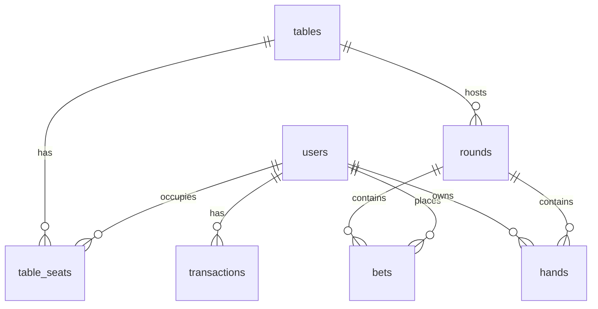

# Schemat bazy danych — PostgreSQL

## Tabele

### users

| Kolumna | Typ | Opis |
|---------|-----|------|
| id | UUID PK | Identyfikator użytkownika |
| email | VARCHAR(255) UNIQUE | Adres e-mail |
| username | VARCHAR(30) UNIQUE | Nazwa użytkownika |
| password_hash | VARCHAR(255) | Hash hasła (bcrypt) |
| role | VARCHAR(20) | `player`, `dealer`, `admin` |
| balance | INTEGER | Saldo żetonów (domyślnie 1000) |
| created_at | TIMESTAMPTZ | Data utworzenia |

### tables

| Kolumna | Typ | Opis |
|---------|-----|------|
| id | UUID PK | Identyfikator stołu |
| name | VARCHAR(100) | Nazwa stołu |
| max_players | INTEGER | Max graczy (2–6) |
| min_bet | INTEGER | Minimalny zakład |
| max_bet | INTEGER | Maksymalny zakład |
| status | VARCHAR(20) | `waiting`, `in_game`, `settlement` |
| created_at | TIMESTAMPTZ | Data utworzenia |

### table_seats

| Kolumna | Typ | Opis |
|---------|-----|------|
| id | UUID PK | Identyfikator miejsca |
| table_id | UUID FK → tables | Stół |
| seat_index | INTEGER | Indeks miejsca (0–6) |
| user_id | UUID FK → users | Użytkownik (nullable) |
| is_dealer | BOOLEAN | Czy krupier |
| joined_at | TIMESTAMPTZ | Czas dołączenia |

### rounds

| Kolumna | Typ | Opis |
|---------|-----|------|
| id | UUID PK | Identyfikator rundy |
| table_id | UUID FK → tables | Stół |
| status | VARCHAR(20) | `betting`, `playing`, `settled` |
| started_at | TIMESTAMPTZ | Start rundy |
| ended_at | TIMESTAMPTZ | Koniec rundy |

### bets

| Kolumna | Typ | Opis |
|---------|-----|------|
| id | UUID PK | Identyfikator zakładu |
| round_id | UUID FK → rounds | Runda |
| user_id | UUID FK → users | Gracz |
| amount | INTEGER | Kwota zakładu |
| hand_id | UUID | Powiązana ręka |
| status | VARCHAR(20) | `active`, `settled`, `refunded` |
| created_at | TIMESTAMPTZ | Czas zakładu |

### hands

| Kolumna | Typ | Opis |
|---------|-----|------|
| id | UUID PK | Identyfikator ręki |
| round_id | UUID FK → rounds | Runda |
| user_id | UUID FK → users | Gracz |
| seat_index | INTEGER | Miejsce przy stole |
| cards | JSONB | Karty w ręce |
| value | INTEGER | Wartość ręki |
| status | VARCHAR(20) | `active`, `bust`, `stand` |
| is_split | BOOLEAN | Czy po split |

### transactions

| Kolumna | Typ | Opis |
|---------|-----|------|
| id | UUID PK | Identyfikator transakcji |
| user_id | UUID FK → users | Użytkownik |
| amount | INTEGER | Kwota (+/-) |
| type | VARCHAR(30) | `bet`, `payout`, `initial`, `refund` |
| round_id | UUID FK → rounds | Powiązana runda |
| created_at | TIMESTAMPTZ | Czas transakcji |

---

## SQL — migracja inicjalna

```sql
CREATE TABLE users (
    id          UUID PRIMARY KEY DEFAULT gen_random_uuid(),
    email       VARCHAR(255) UNIQUE NOT NULL,
    username    VARCHAR(30) UNIQUE NOT NULL,
    password_hash VARCHAR(255) NOT NULL,
    role        VARCHAR(20) NOT NULL DEFAULT 'player'
                CHECK (role IN ('player', 'dealer', 'admin')),
    balance     INTEGER NOT NULL DEFAULT 1000 CHECK (balance >= 0),
    created_at  TIMESTAMPTZ DEFAULT NOW()
);

CREATE TABLE tables (
    id            UUID PRIMARY KEY DEFAULT gen_random_uuid(),
    name          VARCHAR(100) NOT NULL,
    max_players   INTEGER NOT NULL DEFAULT 6 CHECK (max_players BETWEEN 2 AND 6),
    min_bet       INTEGER NOT NULL DEFAULT 10 CHECK (min_bet >= 1),
    max_bet       INTEGER NOT NULL DEFAULT 500,
    status        VARCHAR(20) NOT NULL DEFAULT 'waiting'
                  CHECK (status IN ('waiting', 'in_game', 'settlement')),
    created_at    TIMESTAMPTZ DEFAULT NOW()
);

CREATE TABLE table_seats (
    id          UUID PRIMARY KEY DEFAULT gen_random_uuid(),
    table_id    UUID NOT NULL REFERENCES tables(id) ON DELETE CASCADE,
    seat_index  INTEGER NOT NULL CHECK (seat_index BETWEEN 0 AND 6),
    user_id     UUID REFERENCES users(id),
    is_dealer   BOOLEAN NOT NULL DEFAULT FALSE,
    joined_at   TIMESTAMPTZ,
    UNIQUE (table_id, seat_index),
    UNIQUE (table_id, user_id)
);

CREATE TABLE rounds (
    id          UUID PRIMARY KEY DEFAULT gen_random_uuid(),
    table_id    UUID NOT NULL REFERENCES tables(id),
    status      VARCHAR(20) NOT NULL DEFAULT 'betting'
                CHECK (status IN ('betting', 'playing', 'settled')),
    started_at  TIMESTAMPTZ DEFAULT NOW(),
    ended_at    TIMESTAMPTZ
);

CREATE TABLE bets (
    id          UUID PRIMARY KEY DEFAULT gen_random_uuid(),
    round_id    UUID NOT NULL REFERENCES rounds(id),
    user_id     UUID NOT NULL REFERENCES users(id),
    amount      INTEGER NOT NULL CHECK (amount > 0),
    hand_id     UUID,
    status      VARCHAR(20) DEFAULT 'active'
                CHECK (status IN ('active', 'settled', 'refunded')),
    created_at  TIMESTAMPTZ DEFAULT NOW(),
    UNIQUE (round_id, user_id)
);

CREATE TABLE hands (
    id          UUID PRIMARY KEY DEFAULT gen_random_uuid(),
    round_id    UUID NOT NULL REFERENCES rounds(id),
    user_id     UUID NOT NULL REFERENCES users(id),
    seat_index  INTEGER NOT NULL,
    cards       JSONB NOT NULL DEFAULT '[]',
    value       INTEGER,
    status      VARCHAR(20) DEFAULT 'active',
    is_split    BOOLEAN DEFAULT FALSE
);

CREATE TABLE transactions (
    id          UUID PRIMARY KEY DEFAULT gen_random_uuid(),
    user_id     UUID NOT NULL REFERENCES users(id),
    amount      INTEGER NOT NULL,
    type        VARCHAR(30) NOT NULL
                CHECK (type IN ('bet', 'payout', 'initial', 'refund')),
    round_id    UUID REFERENCES rounds(id),
    created_at  TIMESTAMPTZ DEFAULT NOW()
);

CREATE INDEX idx_users_email ON users(email);
CREATE INDEX idx_table_seats_table_id ON table_seats(table_id);
CREATE INDEX idx_bets_round_id ON bets(round_id);
```

---

## Diagram ERD



---

## Przykładowe zapytania

### Saldo z blokadą (transakcja zakładu)

```sql
SELECT balance FROM users WHERE id = $1 FOR UPDATE;
```

### Lista stołów w lobby

```sql
SELECT t.*,
       COUNT(ts.user_id) FILTER (WHERE NOT ts.is_dealer) AS current_players
FROM tables t
LEFT JOIN table_seats ts ON ts.table_id = t.id
WHERE t.status = 'waiting'
GROUP BY t.id;
```

### Historia rund stołu

```sql
SELECT r.id, r.started_at, r.ended_at,
       json_agg(json_build_object(
           'userId', b.user_id,
           'amount', b.amount
       ))
FROM rounds r
JOIN bets b ON b.round_id = r.id
WHERE r.table_id = $1
GROUP BY r.id
ORDER BY r.started_at DESC
LIMIT 20;
```
